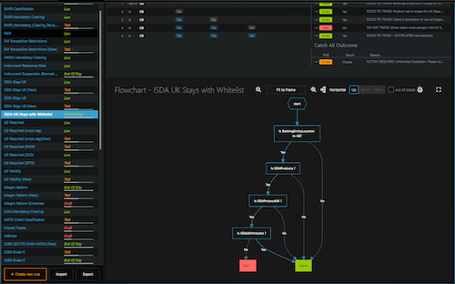
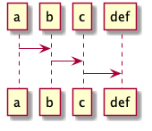

class: center, middle, inverse

# "Focus Mode" - On
### By .red[Ramneek Handa]
---
# Agenda
1. Introduction
2. Emacs
2. Building Diagrams
3. Building Slide Deck
---
# Introduction to "Focus Mode" - On
* A state in which you minimize distraction and get things done faster
* A mode to get most out of you in least amount of time
* Productivity is difficult to attain
  * Starts with carefully observing you work
  * Figuring out and removing distractions (turn those notifications off)
  * Simplifying repetitive things
  * Goto step 1
  * Ends with achieving a meditative state while working
* Remember
  * Computers are good at executing commands
  * You are faster at typing than moving the mouse around
* Lets look at some tools which promote this

.footnote[.red[Meditation] is the practice of focusing your attention on .red[one single point of reference.]]
---
# Emacs
.left-column[
  ## What is it?
]

.right-column[
- https://www.gnu.org/software/emacs/
- An editor from 80s which has solid community and is well maintained 40 years later
- Predates popularity of mouse so has 100% keyboard support
- GNU released first version in 1985
- Over 10k+ built in commands
- Extremely extensible (https://melpa.org/)
- Scripted using elisp (a dialect of lisp)
]
---
# Emacs
.left-column[
  ## What is it?
  ## Basic Principles
]

.right-column[
* Two important keys
  * Ctrl(^)
  * Meta (alt or option key)
* Exit using ^X^C
* Split frame using ^X2 or ^X3
* Maximize frame using ^X1, kill window using ^X0
* Browse file using ^X^F
* Choose buffer for current frame using ^XB
* Everything is a command, M-x and tab
* Tab for completion
* Every command can be bound to a key
  * "^H W" to find the key bound to command
  * "^H K" to find the command bound to key
  * global-set-key to connect key to command
* Extend to your hearts content using packages
* [Cheatsheet to Emacs](https://www.gnu.org/software/emacs/refcards/pdf/refcard.pdf)
]
---
# Building Diagrams 
.left-column[
  ## PlantUml
]

.right-column[
* A tool that parses text to diagrams
* Setup with live-server for focus mode
* Supports variety of diagrams
  * Sequence diagrams
  * Usecase diagrams
  * Class diagrams
  * Activity diagrams
  * and many other types
  * Actively being improved
* Sample using sequence diagram
]
---
# Building Diagrams 
.left-column[
  ## PlantUml
  ## Mermaid
]

.right-column[
* An honourable mention
* Will soon be used in "Rules Editor" to build diagrams

.right[]

]
---
# Building Slide Deck
.left-column[
  ## Remark
]

.right-column[
* A tool that parses markdown to slides
* Setup with live-server for focus mode
* Clean layout from the start
* Layout can be customized
* Focus on the content rather than dragging $hit around
* Link to [remark](https://remarkjs.com/)
]
---
# Building Slide Deck
.left-column[
  ## Remark
  ## Remark with Code
]

.right-column[
```java
while (!focusmode()) {
  distractions  = find_distractions();
  kill_distractions(distractions);
}
```

```javascript
for(focusmode = false; focusmode == true; ) {
  distractions  = find_distractions();
* kill_distractions(distractions);
}
```
]
---
# Building Slide Deck
.left-column[
  ## Remark
  ## Remark with Code
  ## Remark with Images
]

.right-column[

]
---
# Building Slide Deck
.left-column[
  ## Remark
  ## Remark with Code
  ## Remark with Images
  ## Remark with Videos
]

.right-column[
<iframe width="400" height="400" src="https://www.youtube.com/embed/x2KRpRMSu4g" frameborder="0" allow="encrypted-media" allowfullscreen></iframe>
]

